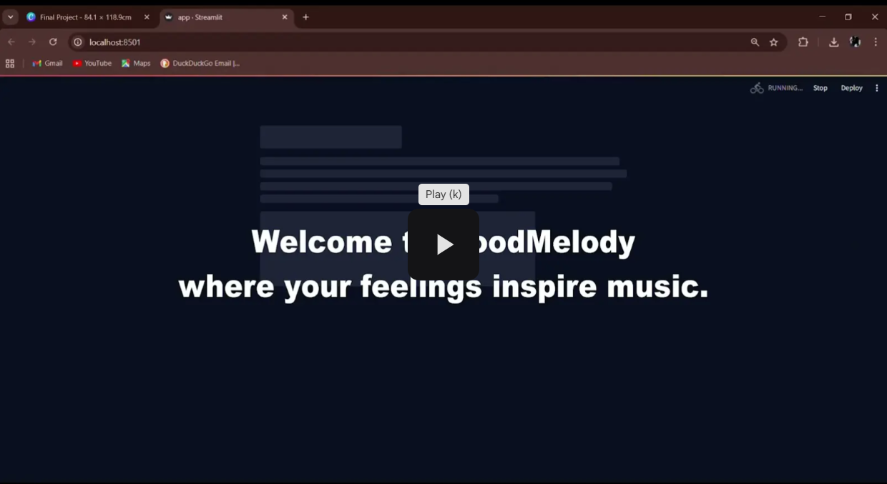
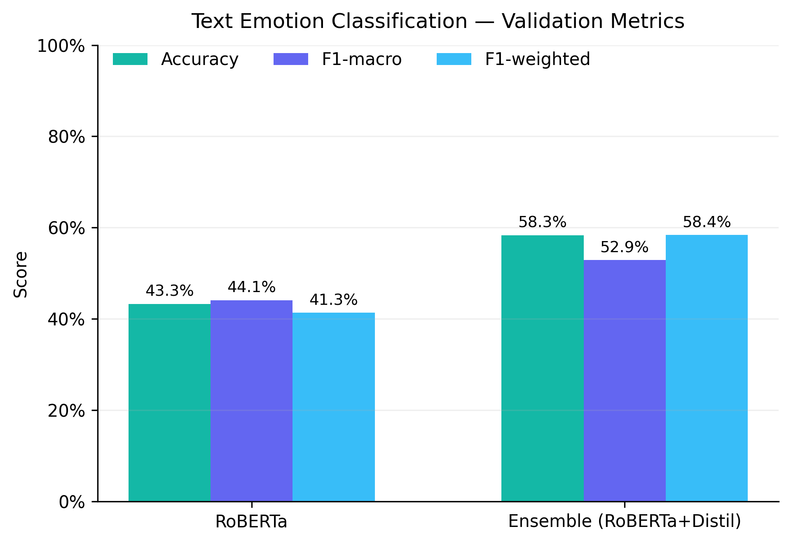
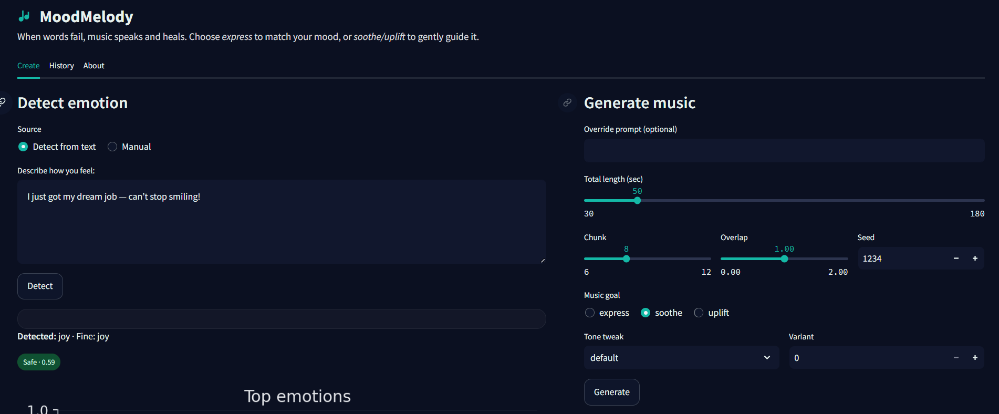
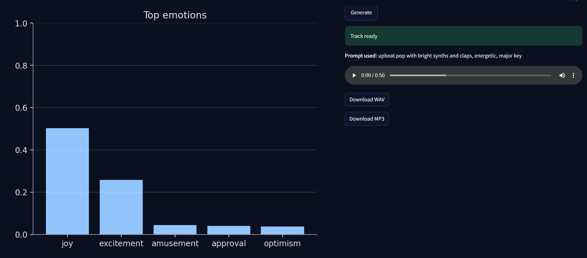
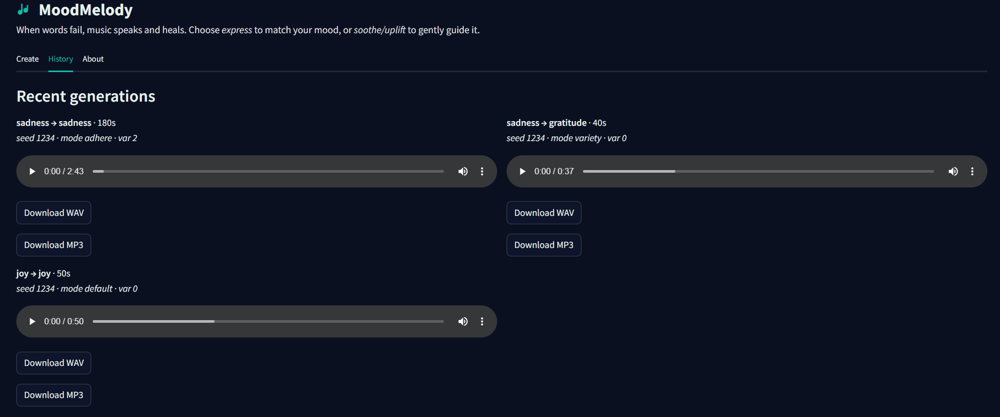

# MoodMelody 
## From Text Emotion to Therapeutic Music (RoBERTa+Distil → MusicGen)

> *"When words fail, music speaks — and heals."*


**Project:** ACM40960 – Projects in Mathematical Modelling, MSc Data & Computational Science, University College Dublin  
**Authors:** Shubham Mahale (24207358), Piyush Jawale (24235815)  
 shubham.mahale@ucdconnect.ie | piyush.jawale@ucdconnect.ie

## Overview

MoodMelody is a **therapeutic AI music generation system** that detects emotions from text and generates custom 60–120s music tracks using Meta’s **MusicGen** model.  
It combines **hybrid emotion detection** (RoBERTa + DistilBERT + distress filter) with an adaptive prompt/generation pipeline to deliver music that **soothes, uplifts, or expresses** emotions.

##  Table of Contents
- [ Problem](#problem)
- [ Gap & Objectives](#gap--objectives)
- [ Impact](#impact)
- [ Key Features](#key-features)
- [ Technical Overview](#technical-overview)
  - [ Datasets](#datasets)
  - [ Label Mapping](#label-mapping)
  - [ Emotion Detection](#emotion-detection)
  - [ Therapeutic Mapping](#therapeutic-mapping)
  - [ Music Generation](#music-generation)
  - [ Video Demo](#demo-video)
  - [ Pipeline](#pipeline)
  - [ Evaluation](#evaluation-goemotions-validation-set-n-5708)
- [ Setup Guide](#setup-guide-any-machine)
- [ Usage Guide](#usage-guide)
- [ Results](#results)
- [ Screenshots](#screenshots)
- [ Future Work](#future-work)
- [ Ethics & Safety](#ethics--safety)
- [ References & Citations](#references--citations)
  - [ Third-Party Notices](#third-party-notices)
  - [ Acknowledgement](#acknowledgement)


---

## Problem

People often express feelings in text — through journals, chats, or therapy notes — but converting these emotions into fitting, supportive music is challenging.  
Prompt-to-music models can be creative yet inconsistent in emotional tone, while pure emotion classifiers are accurate but non-generative.  
For wellbeing, reflection, or focus, users need a **reliable, safe, and controllable emotion-to-music experience**.

---

## Gap & Objectives

Current systems:
- Lack fine affect control and therapeutic mapping (express vs gently guide mood).
- Struggle with rare emotions and nuanced text.
- Face latency and VRAM constraints for long-form generation.

Our objectives:
- **Robust emotion detection** using a hybrid RoBERTa + DistilBERT ensemble.
- **Therapeutic goal mapping**: express / soothe / uplift.
- **Efficient music generation**: chunked MusicGen with crossfades for seamless 1–2 minute tracks on modest GPUs.

---

## Impact

MoodMelody bridges the gap between interpretability (explicit emotion detection) and creativity (music generation).  
It is lightweight, reproducible, and designed with **responsible defaults**:
- Avoids mismatched moods for distressing inputs.
- Prioritises safe and supportive outputs.
- Supports self-reflection, focus, and calm.

---

## Key Features

- **Hybrid Emotion Detection**: RoBERTa + DistilBERT ensemble with label alignment and logit averaging.
- **Distress Filter**: Binary classifier to avoid unsafe or mismatched outputs.
- **Therapeutic Mapping**: Express, soothe, or uplift goals remap emotions for targeted impact.
- **Chunked MusicGen**: 8–10 second segments with 1s crossfades, loudness-aware writing, and prompt libraries per emotion.
- **Streamlit UI**: Real-time detection → generation → playback, with ETA tracking and rotating calming quotes.


## Technical Overview

MoodMelody’s architecture combines **NLP-based emotion recognition** with **conditional music generation** for therapeutic purposes.  
The system runs locally and is optimised for GPUs with as little as 4 GB VRAM.

---

### Datasets
- **GoEmotions** (Google Research): 58k single-label examples (cleaned from 197k original).  
  Used to fine-tune RoBERTa for 27 fine-grained emotions.  
  Max token length: 48, covering 99% of samples.
- **Dreaddit**: ~4k Reddit posts labeled for stress/distress.  
  Used to train a binary distress classifier for safe content filtering.

---

### Label Mapping
- 27 fine-grained emotions → 7 coarse categories:  
  **joy, sadness, anger, fear, love, gratitude, calm/neutral**.
- Edge labels (surprise, disapproval, embarrassment) mapped to *calm/neutral* to reduce unintended negativity.
- Mapping is configurable for different therapeutic contexts.

---

### Emotion Detection
1. **RoBERTa-base** (fine-tuned on single-label GoEmotions).
2. **DistilBERT** (pretrained model aligned to GoEmotions label space).
3. **Logit Averaging**: Normalised label alignment, weighted average (best: 0.4 / 0.6 RoBERTa–DistilBERT).
4. **Distress Filter**: Blocks unsafe fine emotions before mapping.

---

### Therapeutic Mapping
- User selects a **goal**:  
  - *Express*: Keep original coarse emotion.  
  - *Soothe*: Map high-arousal negative emotions → calm.  
  - *Uplift*: Map low-arousal negative → joy/gratitude.
- Mapping rules are stored in a config and can be customised.

---

### Music Generation
- **Meta AI MusicGen-small** model (facebook/musicgen-small).
- Emotion → Prompt library: Pre-tuned parameters (temperature, top-k, CFG scale) per coarse emotion.
- **Chunked generation**: 8–10 s segments with **1 s crossfades** to avoid VRAM spikes.
- Loudness-aware writing to prevent clipping.
- Output: WAV (lossless) and MP3 (compressed).

---


### Demo Video

Experience MoodMelody in action:  
### Demo Video
[](https://drive.google.com/file/d/1ZR3vjpaonKs8GeRt9u0zvaaodVaZDe7-/view?usp=sharing)

---
### Pipeline
1. **Text Input** → Hybrid Emotion Detection (RoBERTa + DistilBERT) → Distress Filter.
2. **Fine → Coarse Mapping** → Therapeutic Goal Remapping.
3. **Prompt Selection** → MusicGen chunked synthesis → Crossfade merge.
4. **Streamlit UI**: Displays detected emotions, plays generated track, offers download.

---

### Evaluation (GoEmotions Validation Set, n=5,708)
| Model                  | Accuracy | Macro-F1 | Weighted-F1 |
|------------------------|----------|----------|-------------|
| RoBERTa (baseline)     | 43.3%    | 0.441    | 0.413       |
| Ensemble (0.4/0.6)     | **58.3%**| **0.529**| **0.584**   |

Ensemble improves macro-F1 by **+8.8 points**, critical for handling rare emotions in music therapy.

<p align="center" style="background-color:#f5f5f5; padding:10px; border-radius:10px;">
  
</p>


## Setup Guide (Any Machine)

> Works best on **Linux/Windows** with an NVIDIA GPU (CUDA).  
> CPU and Apple Silicon (M-series) are supported but **much slower** for music generation.

---

### **0) Prerequisites**
- **Git** – to clone the repo.
- **Conda / Mambaforge** – recommended for dependency management.
- **GPU** (optional but recommended): NVIDIA with recent drivers (CUDA 11.8 or 12.x).  
  > A modest GPU (e.g., GTX 1650 Ti, 4 GB VRAM) can produce 60–120 s tracks with chunking.  
  > Music generation on CPU can take **minutes** per 8 s chunk.

---

### **1) Clone the repo**
```
git clone https://github.com/ACM40960/project-project-in-math-modelling-ai-music.git
cd moodmelody
```

### **2) Create the environment

**A) Windows / Linux (Conda)**
```
conda create -n sonicaid python=3.10 -y
conda activate sonicaid
python -m pip install --upgrade pip
```
**B) Apple Silicon (M-series) – CPU/MPS**
```
conda create -n sonicaid python=3.10 -y
conda activate sonicaid
python -m pip install --upgrade pip
# Install PyTorch CPU/MPS (no CUDA on macOS)
pip install torch torchvision torchaudio
```
PyTorch supports Metal (MPS) on macOS, but Audiocraft/MusicGen runs much slower than CUDA.

### **3) Install PyTorch (choose one)**

**CUDA 11.8 (Windows/Linux)**
```
pip install torch==2.1.0+cu118 torchvision==0.16.0+cu118 torchaudio==2.1.0+cu118 \
  --index-url https://download.pytorch.org/whl/cu118
```

**CUDA 12.1 (Linux with newer drivers)**
```
pip install torch==2.1.0+cu121 torchvision==0.16.0+cu121 torchaudio==2.1.0+cu121 \
  --index-url https://download.pytorch.org/whl/cu121
```

**CPU-only**
```
pip install torch==2.1.0 torchvision==0.16.0 torchaudio==2.1.0
```

**Sanity check:**
```
python - << 'PY'
import torch
print("torch:", torch.__version__, "| cuda:", torch.cuda.is_available())
PY
```

### **4) Install project libraries**
```
pip install audiocraft==1.3.0 transformers==4.37.2 tokenizers==0.15.0 \
  datasets==2.17.1 scikit-learn==1.3.* evaluate==0.4.1 \
  numpy==1.26.4 pandas==2.2.* \
  librosa==0.10.* soundfile pydub matplotlib==3.8.* \
  streamlit==1.36.* accelerate==0.25.*
```

**Why these libraries?**

>torch / torchvision / torchaudio — deep learning runtime (GPU acceleration).

>transformers, tokenizers — RoBERTa/DistilBERT classifiers.

>datasets, evaluate, scikit-learn — data loading & metrics.

>audiocraft — Meta’s MusicGen.

>librosa, soundfile — audio utilities.

>pydub — MP3 export and fades (via FFmpeg).

>matplotlib — charts in the UI.

>streamlit — web UI.

>accelerate — HF runtime compatibility.

### **5) FFmpeg (for MP3 export)**

Conda (recommended):
```
conda install -c conda-forge ffmpeg -y
```

Or install system-wide and ensure ffmpeg is on PATH.
Without FFmpeg, WAV output works; MP3 export is skipped.


### **6) Models & data layout**

```
GoEmotions (Kaggle search): https://www.kaggle.com/datasets?search=goemotions
Dreaddit  (Kaggle search):  https://www.kaggle.com/datasets?search=dreaddit
```
> Download the datasets place that in data/raw/ folder.
>The repo includes ZIPs of trained models (because large binary folders aren’t committed). Unzip them into saved_models/ so the structure looks like:
```
saved_models/
├─ roberta-goemotion-final/
├─ goemotions_distilbert_v3/
└─ distress_classifier/

data/raw/
├─ goemotions_df.csv
└─ dreaddit_df.csv`
```
### **7) Quick smoke tests**

**A) Emotion inference**
```
python - << 'PY'
from hybrid_infer import hybrid_predict
print(hybrid_predict("I feel so hopeless and tired of everything."))
PY
```
Expected: dictionary with chosen_emotion_coarse, chosen_emotion_fine, distress, and top-k emotions.

**B) Music generation (CLI)**
```
python -m part2_musicgen.pipeline --emotion gratitude --total 30 --chunk 8 --overlap 1.0 --outfile outputs/gratitude_30s.wav
```
**8) Run the Streamlit app**
```
streamlit run app.py
```
Open http://localhost:8501 in your browser.

**9) Troubleshooting**

-Triton warning — harmless on Windows/older CUDA.

-MusicGen .to() / seed errors — already handled in code.

-Tokenizer error — ensure correct tokenizer is used.

-MP3 export fails — install FFmpeg.

-Black Streamlit screen — check st.set_page_config(...) placement.

-Slow generation — reduce chunk size, ensure GPU is used.

### **10) Optional: environment files**

**environment.yml (Conda)**
```
name: MoodMelody
channels: [conda-forge, pytorch, nvidia]
dependencies:
  - python=3.10
  - pip
  - ffmpeg
  - pip:
      - torch==2.1.0+cu118
      - torchvision==0.16.0+cu118
      - torchaudio==2.1.0+cu118
      - --extra-index-url https://download.pytorch.org/whl/cu118
      - audiocraft==1.3.0
      - transformers==4.37.2
      - tokenizers==0.15.0
      - datasets==2.17.1
      - evaluate==0.4.1
      - scikit-learn==1.3.*
      - numpy==1.26.4
      - pandas==2.2.*
      - librosa==0.10.*
      - soundfile
      - pydub
      - matplotlib==3.8.*
      - streamlit==1.36.*
      - accelerate==0.25.*

```
**requirements.txt (pip)**
```
audiocraft==1.3.0
transformers==4.37.2
tokenizers==0.15.0
datasets==2.17.1
evaluate==0.4.1
scikit-learn==1.3.*
numpy==1.26.4
pandas==2.2.*
librosa==0.10.*
soundfile
pydub
matplotlib==3.8.*
streamlit==1.36.*
accelerate==0.25.*
```

### **11) One-line health check**
```
python - << 'PY'
import torch, transformers, numpy as np
print("torch:", torch.__version__, "| cuda:", torch.cuda.is_available())
print("transformers:", __import__("transformers").__version__)
print("numpy:", np.__version__)
PY
```

You’re good to go if:

**cuda: True on GPU machine,**

CLI test produces a WAV in outputs/.


## Usage Guide

MoodMelody can be run in two modes:
1. **CLI (Command-Line Interface)** — quick testing, scripting, or batch generation.
2. **Streamlit UI** — interactive web app with emotion detection, generation controls, and playback.

---

### ** Model Downloads**
We do **not** commit large model weights to the repo.  
Download them from the repo and extract into `saved_models/`:


**Tip:** Without these models, `hybrid_infer.py` can be run in RoBERTa-only mode by commenting out the DistilBERT load.

---

### ** 1) CLI Mode**

Generate music directly from the terminal.

**Example: 90-second gratitude track**
```
python -m part2_musicgen.pipeline \
    --emotion gratitude \
    --total 90 \
    --chunk 8 \
    --overlap 1.0 \
    --outfile outputs/gratitude_90s.wav
```

**Arguments:**
--emotion — coarse emotion category (joy, sadness, anger, fear, love, gratitude, calm).
--total — total track length in seconds.
--chunk — chunk length for generation (smaller chunks reduce VRAM load).
--overlap — crossfade overlap in seconds.
--outfile — output path (WAV).

### **2) Streamlit UI Mode**

Launch the interactive app:
```
streamlit run app.py
```
Default URL: http://localhost:8501

**UI Features**

- Text input → detect emotion → select therapeutic goal (express, soothe, uplift).
- Adjust generation settings: track length, chunk size, overlap.
- Real-time ETA + rotating calming quotes during generation.
- Playback controls — listen before download.
- Download in WAV or MP3 (if FFmpeg installed).
- History view — see previous tracks with emotions, params, and replay buttons.

| Main Page | Emotion Analysis | Generation History |
|-----------|------------------|--------------------|
|  |  |  |


**Example Workflow**

1. Start the app (streamlit run app.py).
2. Paste a text: "I feel calm and at peace after a long walk."
3. System detects coarse emotion = calm (therapeutic goal: uplift → joy).
4. MusicGen generates a 60-second track with gentle positive tones.
5. Play in browser or download as calm_uplift.wav.

### **Notes**

1. First run will be slower (model load into GPU/CPU memory).
2. On CPU, generation is 5–10× slower.
3. If distress is detected, output is automatically biased toward calming tracks.

## Results

**Evaluation Dataset:** GoEmotions validation set (n = 5,708, cleaned single-label).  

| Model                  | Accuracy | Macro-F1 | Weighted-F1 |
|------------------------|----------|----------|-------------|
| RoBERTa (baseline)     | 43.3%    | 0.441    | 0.413       |
| Ensemble (0.4/0.6)     | **58.3%**| **0.529**| **0.584**   |

**Key Gains:**
- **+15.1% Accuracy** improvement over baseline.
- **+8.8 Macro-F1** — better handling of rare emotions.
- **+17.1 Weighted-F1** — balanced performance across frequent & infrequent classes.

These gains are critical for **music therapy**, as improved tail-class accuracy ensures better mapping to therapeutic music categories.

---


## Future Work

- **Personalised Mood Diaries**  
  Secure, opt-in mood diary to adapt prompts and generation parameters over time.

- **Lyrics + Music Generation**  
  Co-generate short, theme-consistent lyrics with mood-matched instrumentals.

- **Live Emotion Detection from Camera**  
  On-device facial expression recognition for real-time valence/arousal mapping.

- **Faster Generation & Scalability**  
  FP16/INT8 optimisation, chunk tuning, GPU caching, or optional cloud GPU with batching.

---

## Ethics & Safety
- This is a **wellbeing tool**, not a medical or diagnostic device.
- All text inputs remain **local** by default — no logging or transmission without consent.
- Distress detection biases outputs toward calm, soothing responses.
- Trained on Reddit-style text; musical perception is subjective — results may vary.

## References & Citations

If you use this work, please cite the following resources:

```bibtex
@inproceedings{wolf-etal-2020-transformers,
  title={Transformers: State-of-the-Art Natural Language Processing},
  author={Wolf, Thomas and Debut, Lysandre and Sanh, Victor and et al.},
  booktitle={Proceedings of EMNLP 2020: System Demonstrations},
  year={2020}
}

@article{paszke2019pytorch,
  title={PyTorch: An Imperative Style, High-Performance Deep Learning Library},
  author={Paszke, Adam and Gross, Sam and Massa, Francisco and et al.},
  journal={NeurIPS},
  year={2019}
}

@article{copet2023simple,
  title={Simple and Controllable Music Generation},
  author={Copet, Jade and D{\'e}fossez, Alexandre and Lample, Guillaume and et al.},
  year={2023},
  journal={arXiv preprint arXiv:2306.05284}
}

@article{liu2019roberta,
  title={RoBERTa: A Robustly Optimized BERT Pretraining Approach},
  author={Liu, Yinhan and Ott, Myle and Goyal, Naman and et al.},
  journal={arXiv:1907.11692},
  year={2019}
}

@article{sanh2019distilbert,
  title={DistilBERT, a distilled version of BERT: smaller, faster, cheaper and lighter},
  author={Sanh, Victor and Debut, Lysandre and Chaumond, Julien and Wolf, Thomas},
  journal={arXiv:1910.01108},
  year={2019}
}

@inproceedings{demszky2020goemotions,
  title={GoEmotions: A Dataset of Fine-Grained Emotions},
  author={Demszky, Dorottya and Movshovitz-Attias, Dana and Ko, Jeongwoo and et al.},
  booktitle={ACL},
  year={2020}
}

@inproceedings{turcan2019dreaddit,
  title={Dreaddit: A Reddit Dataset for Stress Analysis in Social Media},
  author={Turcan, Elsbeth and McKeown, Kathleen},
  booktitle={LREC},
  year={2019}
}
```

### **Third-Party Notices**

This project uses:
- Meta AI Audiocraft / MusicGen – facebookresearch/audiocraft, checkpoint facebook/musicgen-small
- Hugging Face Transformers and base models (roberta-base, distilbert-base-uncased)
- Datasets: GoEmotions, Dreaddit

Each of the above is distributed under its original license.
See their respective model cards, dataset pages, or repositories for details.

### **Acknowledgement**

- This project was developed as part of a Master's module at University College Dublin for research and educational purposes only.
It is not intended for commercial use.
The system integrates open-source models and datasets, including:
- Emotion classification models from Hugging Face
- Music generation via Meta’s AudioCraft framework
- We gratefully acknowledge the contributions of the open-source community.